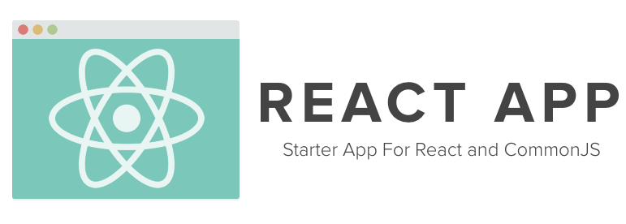

**Goals**:
  - Rapidly build applications with `React`/`JSX`/`commonJS`.
  - Hit refresh to load new experience **instantly** (no watching file system)
  - *Just Works* on Mac/Linux/Windows/rawgithub.
  - Server rendering playground.

**Possible Add-Ons**:
  - Single OS Keyboard shortcut to:
    - Clone new `reactapp`, open it in browser and text editor.
    - One second between a new idea and building that idea.
  - Reload/rerender modules as you type in text editor (only the ones that changed).

 

###Install

    git clone https://github.com/jordwalke/reactapp
    cd reactapp
    npm install                 # install dependencies.

### Run

| Option 1: Command Line Build                                                                                                                             | Option 2: Web Server                                                | Option 3: In-Browser |
| :------------------------------------------------------------------------------------------------------------------------------------------------------- |:--------------------------------------------------------------------| :-------------------:|
| <pre>sudo npm install -g browserify browserify -t reactify \\   lib/client/clientMain.jsx > ./build/build.js  open ./index.html</pre> | <pre>node server/serverMain.js open http://localhost:8080</pre>  | `Coming Soon`        |

###Structure

     reactapp/
      ├── index.html
      ├── package.json
      ├── README.md
      ├── build/
      │   └── build.js
      └── lib/
          ├── components/           # All application UI components
          │   └── Application.jsx   # The Top Level Component
          │   └── Widget.jsx        # A View style component.
          ├── client/               # client-only code
          │   └── clientMain.jsx
          └── server                # server-only code
              └── serverMain.jsx
